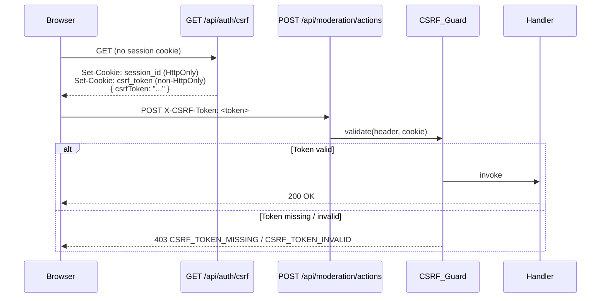

# Design Document: CSRF Protection

## Overview

This document describes the technical design for adding CSRF (Cross-Site Request
Forgery) protection to Prompt Mint's off-chain API layer.

The existing admin mutation endpoints — moderation actions, seller review responses,
review edits, prompt version posting, and secret rotation — rely on wallet-signed
proofs or a static bearer token. Those mechanisms prove *identity* but do not
prevent a malicious third-party page from exploiting an authenticated browser
session to issue state-changing requests on the user's behalf.

The solution follows the **Double Submit Cookie** pattern: the server issues a
short-lived, HMAC-signed CSRF token at session start; the browser reads it from a
non-`HttpOnly` cookie and echoes it back as a custom `X-CSRF-Token` request header;
the server compares header value against cookie value (and verifies the embedded
HMAC signature). An attacker's page can trigger cross-origin requests but cannot
read the first-party cookie, so it cannot supply the matching header.

The design:

- introduces `withCsrfGuard`, a higher-order middleware that follows the existing
  `withBodySizeLimit` / `withObservability` composition pattern;
- adds a `GET /api/auth/csrf` token-issuance endpoint;
- integrates CSRF validation into the five covered admin mutation endpoints;
- leaves all read-only GET endpoints and the Soroban unlock/challenge flow entirely
  unaffected;
- reuses the challenge-token HMAC-signing approach (`createHmac`, `timingSafeEqual`,
  `base64url` encoding) already present in `src/lib/auth/challenge.ts`.

---

## Architecture

### Middleware Composition

The existing pattern is a stack of higher-order functions, innermost first:

```
withObservability(
  withBodySizeLimit(
    handler
  )
)
```

CSRF validation wraps the inner handler *before* observability so that a CSRF
rejection is still logged with a request ID, but *after* the handler receives its
body — because `withCsrfGuard` reads headers and cookies, not the body:

```
withObservability(
  withCsrfGuard(
    withBodySizeLimit(
      handler
    )
  )
)
```

`withCsrfGuard` is stateless: it reads the `X-CSRF-Token` header and the session
cookie from `req`, computes the validation result, and either short-circuits with
a 403 response or calls the next handler unchanged.

### Request flow for an Admin Mutation



---

## Components and Interfaces

### 1. `src/lib/auth/csrfGuard.ts` — core module

Exports:

```typescript
// Cookie and header names
export const SESSION_COOKIE = "pm_session_id";
export const CSRF_COOKIE    = "pm_csrf_token";
export const CSRF_HEADER    = "X-CSRF-Token";

export interface CsrfTokenPayload {
  sessionId: string;
  expiresAt: number;
}

/** Issue a new signed CSRF token bound to a session. */
export function issueCsrfToken(
  sessionId: string,
  secret: string,
  now?: number,
  ttlMs?: number,
): string;

/**
 * Validate a CSRF token.
 * Returns true when the token signature is intact, it has not expired,
 * and it is bound to the supplied sessionId.
 * Throws never — returns false for any failure to ensure withCsrfGuard
 * can safely distinguish "invalid" from "system error".
 */
export function validateCsrfToken(
  token: string,
  sessionId: string,
  secret: string | string[],
  now?: number,
): boolean;

/** Higher-order function — wraps any ApiHandler with CSRF validation. */
export function withCsrfGuard(handler: ApiHandler): ApiHandler;
```

#### Token format

```
base64url(JSON.stringify({ sessionId, expiresAt }))
  + "."
  + HMAC-SHA256(secret, encodedPayload).digest("base64url")
```

Identical structure to the existing `ChallengePayload` token format in
`src/lib/auth/challenge.ts`, so the same `base64UrlEncode` / `signPayload`
helpers can be reused (or extracted to a shared utility).

#### Secret resolution

`withCsrfGuard` reads secrets from the environment at call time (not module-load
time) so tests can inject values via `process.env`:

```typescript
function getSecrets(): { current: string; previous?: string; gracePeriodMs: number } {
  const current = process.env.CSRF_SECRET ?? "";
  if (!current || current.length < 32) {
    throw new ConfigurationError("CSRF_SECRET must be at least 32 characters");
  }
  return {
    current,
    previous: process.env.CSRF_SECRET_PREVIOUS,
    gracePeriodMs: Number(process.env.CSRF_TOKEN_GRACE_PERIOD_MS ?? 300_000),
  };
}
```

Startup validation (logged at module import in server entrypoints) warns if
`CSRF_SECRET === CHALLENGE_TOKEN_SECRET`.

#### Origin validation

When an `Origin` header is present and `ALLOWED_ORIGINS` is configured, the guard
checks membership before token validation:

```typescript
function isOriginAllowed(origin: string | undefined): boolean {
  const allowed = (process.env.ALLOWED_ORIGINS ?? "")
    .split(",").map(s => s.trim()).filter(Boolean);
  if (allowed.length === 0) return true;          // not configured — skip
  if (!origin) return true;                        // server-to-server — skip
  return allowed.includes(origin);
}
```

A failed origin check returns `403 CSRF_TOKEN_INVALID` (same code as a bad token,
to avoid leaking information about *why* the request was rejected).

---

### 2. `api/auth/csrf.ts` — token issuance endpoint

`GET /api/auth/csrf`

1. Read `SESSION_COOKIE` from `req.cookies`.
2. If absent, generate a new session ID with `randomUUID()`.
3. Call `issueCsrfToken(sessionId, secret)`.
4. Set the session cookie (`HttpOnly`, `Secure`, `SameSite=Strict`, `Path=/`).
5. Set the CSRF cookie (same flags minus `HttpOnly`, `Path=/`).
6. Return `{ csrfToken: token }`.

The endpoint is wrapped with `withObservability` only (no body-size guard needed
for a GET; no CSRF guard on the issuance endpoint itself).

---

### 3. Error codes — `src/lib/api/errorCodes.ts`

Two new entries added to the `ErrorCode` const object and `ERROR_MESSAGES` record:

| Code | HTTP | Human-readable message |
|---|---|---|
| `CSRF_TOKEN_MISSING` | 403 | "A CSRF token is required for this action. Please refresh the page and try again." |
| `CSRF_TOKEN_INVALID` | 403 | "The CSRF token is invalid or has expired. Please refresh the page and try again." |

---

### 4. Covered endpoints — `withCsrfGuard` applied

| File | Route | Method |
|---|---|---|
| `api/moderation/actions.ts` | `/api/moderation/actions` | POST |
| `api/reviews/respond.ts` | `/api/reviews/respond` | POST |
| `api/reviews/edit.ts` | `/api/reviews/edit` | PUT |
| `api/prompts/version.ts` | `/api/prompts/version` | POST (guard applied only for POST method inside the shared handler) |
| `api/auth/rotateSecret.ts` | `/api/auth/rotateSecret` | POST |

Example composition for `moderation/actions.ts`:

```typescript
export default withObservability(
  withCsrfGuard(
    withBodySizeLimit(handler)
  ),
  "moderation/actions",
);
```

For `api/prompts/version.ts`, which handles both GET and POST in the same handler,
`withCsrfGuard` must inspect `req.method` and skip validation for GET requests:

```typescript
// Inside withCsrfGuard, before validation:
const SAFE_METHODS = new Set(["GET", "HEAD", "OPTIONS"]);
if (SAFE_METHODS.has(req.method?.toUpperCase())) {
  return handler(req, res);
}
```

---

## Data Models

### CsrfTokenPayload (in-band, encoded in the token)

```typescript
interface CsrfTokenPayload {
  sessionId: string;   // opaque UUID bound to the browser session
  expiresAt: number;   // Unix epoch milliseconds
}
```

### Environment variables (additions)

| Variable | Required | Default | Notes |
|---|---|---|---|
| `CSRF_SECRET` | Yes | — | Min 32 chars; HMAC signing key |
| `CSRF_SECRET_PREVIOUS` | No | — | Previous secret; accepted during grace period |
| `CSRF_TOKEN_TTL_MS` | No | `86400000` (24 h) | Token lifetime in ms |
| `CSRF_TOKEN_GRACE_PERIOD_MS` | No | `300000` (5 min) | Grace window for secret rotation |
| `ALLOWED_ORIGINS` | No | — | Comma-separated; if absent, origin check is skipped |

### Cookie schema

| Cookie | `HttpOnly` | `Secure` | `SameSite` | Purpose |
|---|---|---|---|---|
| `pm_session_id` | ✓ | ✓ | Strict | Session binding; not readable by JS |
| `pm_csrf_token` | ✗ | ✓ | Strict | CSRF token; readable by JS via `document.cookie` |

---

## Correctness Properties

*A property is a characteristic or behavior that should hold true across all valid
executions of a system — essentially, a formal statement about what the system
should do. Properties serve as the bridge between human-readable specifications
and machine-verifiable correctness guarantees.*

### Property 1: Round-trip validity

*For any* valid triple `(sessionId: string, secret: string, ttlMs: number)` where
`secret.length >= 32` and `ttlMs > 0`, calling `validateCsrfToken(issueCsrfToken(sessionId, secret, now, ttlMs), sessionId, secret, now)` SHALL return `true`.

**Validates: Requirements 1.5, 2.3, 9.5**

---

### Property 2: Session binding

*For any* two distinct session identifiers `sessionId_A ≠ sessionId_B` and any
valid secret, a CSRF token issued for `sessionId_A` SHALL always fail validation
when presented with `sessionId_B`, and vice-versa.

**Validates: Requirements 2.3, 9.6**

---

### Property 3: TTL enforcement

*For any* positive TTL value `ttlMs`, a token issued at time `T` SHALL be valid at
`T + ttlMs - 1` and invalid at `T + ttlMs + 1`.

**Validates: Requirements 1.7**

---

### Property 4: Secret rotation grace period

*For any* token issued with `CSRF_SECRET_PREVIOUS` at rotation time `R` and grace
period `G`, the token SHALL be accepted when `now < R + G` and rejected when
`now >= R + G`.

**Validates: Requirements 7.4, 7.5, 9.4**

---

### Property 5: Middleware passthrough preserves request

*For any* valid `(sessionId, token)` pair, wrapping a capturing handler with
`withCsrfGuard` and calling it with the correct `X-CSRF-Token` header and session
cookie SHALL invoke the inner handler with an unmodified `req` object — no fields
added, changed, or removed by the CSRF guard layer.

**Validates: Requirements 2.6, 6.3**

---

### Property 6: Error responses never leak internal state

*For any* CSRF validation failure scenario (missing token, invalid token, wrong
session, wrong origin), the serialised response body SHALL NOT contain the session
ID value, the token value, or any secret material.

**Validates: Requirements 5.4**

---

### Property 7: Origin check membership

*For any* non-empty `ALLOWED_ORIGINS` list and any incoming `Origin` header value,
the guard SHALL accept the request if and only if the origin is a member of the
allowed list.

**Validates: Requirements 4.1, 4.2**

---

## Error Handling

| Scenario | Guard response | Wrapped handler called? |
|---|---|---|
| `CSRF_SECRET` too short / absent | `500 CONFIGURATION_ERROR` | No |
| `X-CSRF-Token` header absent or empty | `403 CSRF_TOKEN_MISSING` | No |
| Token signature invalid / tampered | `403 CSRF_TOKEN_INVALID` | No |
| Token expired | `403 CSRF_TOKEN_INVALID` | No |
| Session ID mismatch | `403 CSRF_TOKEN_INVALID` | No |
| `Origin` not in `ALLOWED_ORIGINS` | `403 CSRF_TOKEN_INVALID` | No |
| Unexpected error in `validateCsrfToken` | `500` (re-throw to `withObservability`) | No |
| Wrapped handler throws | `500` (caught by `withObservability`) | Yes (threw) |
| Validation passes | — | Yes |

All error responses use the `apiError(code, message)` helper from
`src/lib/api/errorCodes.ts` so the body always matches `ApiErrorResponse`.

Error responses never include the session ID, token value, or CSRF secret — only
the human-readable message and the stable error code.

---

## Testing Strategy

The project uses **Vitest** (see `package.json` `"test": "vitest run"`). Tests live
alongside source files (`*.test.ts`).

### Property-based testing library

**fast-check** (`npm add -D fast-check`) is the appropriate choice for this
TypeScript/Vitest project. It integrates with Vitest via `fc.assert(fc.property(…))`
and runs 100 iterations by default (configurable via `{ numRuns: 100 }`).

Each property test is tagged with a comment in this format:
`// Feature: csrf-protection, Property N: <property_text>`

### Unit tests (example-based)

File: `src/lib/auth/csrfGuard.test.ts`

- Issuance returns a token matching the `base64url.base64url` format
- New session is created and session cookie has `HttpOnly`, `Secure`, `SameSite=Strict`
- CSRF cookie lacks `HttpOnly` and is `Secure`, `SameSite=Strict`
- Missing `X-CSRF-Token` header → `403 CSRF_TOKEN_MISSING`
- Tampered token → `403 CSRF_TOKEN_INVALID`
- Expired token → `403 CSRF_TOKEN_INVALID`
- `CSRF_SECRET` shorter than 32 chars → `500 CONFIGURATION_ERROR`
- `ALLOWED_ORIGINS` absent → origin header ignored, request proceeds
- Absent `Origin` header with valid token → request passes (server-to-server)
- `withCsrfGuard`-wrapped mock handler is never invoked when CSRF fails
- `withCsrfGuard`-wrapped mock handler is invoked when CSRF passes
- Both `CSRF_TOKEN_MISSING` and `CSRF_TOKEN_INVALID` present in `ErrorCode`
- Both codes present in `ERROR_MESSAGES` with non-empty strings
- Error responses do not include session ID or token value

### Property-based tests

File: `src/lib/auth/csrfGuard.test.ts` (same file, separate `describe` block)

```typescript
// Feature: csrf-protection, Property 1: round-trip validity
fc.assert(fc.property(
  fc.string({ minLength: 32 }),   // secret
  fc.uuid(),                      // sessionId
  fc.integer({ min: 1000, max: 86_400_000 }), // ttlMs
  (secret, sessionId, ttlMs) => {
    const now = Date.now();
    const token = issueCsrfToken(sessionId, secret, now, ttlMs);
    return validateCsrfToken(token, sessionId, secret, now);
  }
), { numRuns: 100 });

// Feature: csrf-protection, Property 2: session binding
fc.assert(fc.property(
  fc.string({ minLength: 32 }),
  fc.tuple(fc.uuid(), fc.uuid()).filter(([a, b]) => a !== b),
  (secret, [sessionA, sessionB]) => {
    const now = Date.now();
    const token = issueCsrfToken(sessionA, secret, now);
    return !validateCsrfToken(token, sessionB, secret, now);
  }
), { numRuns: 100 });

// Feature: csrf-protection, Property 3: TTL enforcement
fc.assert(fc.property(
  fc.string({ minLength: 32 }),
  fc.uuid(),
  fc.integer({ min: 1000, max: 3_600_000 }),
  (secret, sessionId, ttlMs) => {
    const now = 1_700_000_000_000;
    const token = issueCsrfToken(sessionId, secret, now, ttlMs);
    const validBefore = validateCsrfToken(token, sessionId, secret, now + ttlMs - 1);
    const invalidAfter = !validateCsrfToken(token, sessionId, secret, now + ttlMs + 1);
    return validBefore && invalidAfter;
  }
), { numRuns: 100 });

// Feature: csrf-protection, Property 5: middleware passthrough preserves request
fc.assert(fc.property(
  fc.string({ minLength: 32 }),
  fc.uuid(),
  (secret, sessionId) => {
    // ... invoke withCsrfGuard wrapping a capturing handler ...
    // assert captured req fields === original req fields
  }
), { numRuns: 100 });

// Feature: csrf-protection, Property 6: error responses never leak internal state
fc.assert(fc.property(
  fc.oneof(
    fc.constant({ header: undefined }),
    fc.record({ header: fc.string() }),  // tampered token
  ),
  (scenario) => {
    // ... call withCsrfGuard with failing scenario ...
    // assert JSON.stringify(responseBody) does not contain sessionId or token
  }
), { numRuns: 100 });

// Feature: csrf-protection, Property 7: origin check membership
fc.assert(fc.property(
  fc.array(fc.webUrl(), { minLength: 1, maxLength: 5 }),
  fc.webUrl(),
  (allowedOrigins, incomingOrigin) => {
    const inList = allowedOrigins.includes(incomingOrigin);
    // set ALLOWED_ORIGINS = allowedOrigins.join(",")
    // call guard with Origin: incomingOrigin and valid token
    // assert: accepted iff inList
  }
), { numRuns: 100 });
```

### Integration tests

For the five covered endpoints, a higher-level integration test (using the
existing `node-mock-http` pattern) verifies:

1. A request with no CSRF token returns `403 CSRF_TOKEN_MISSING`.
2. A request with a valid CSRF token reaches the inner handler.
3. GET requests on the same handler (e.g. `GET /api/prompts/version`) are not
   blocked by the guard.

These tests run as part of `yarn test`.
